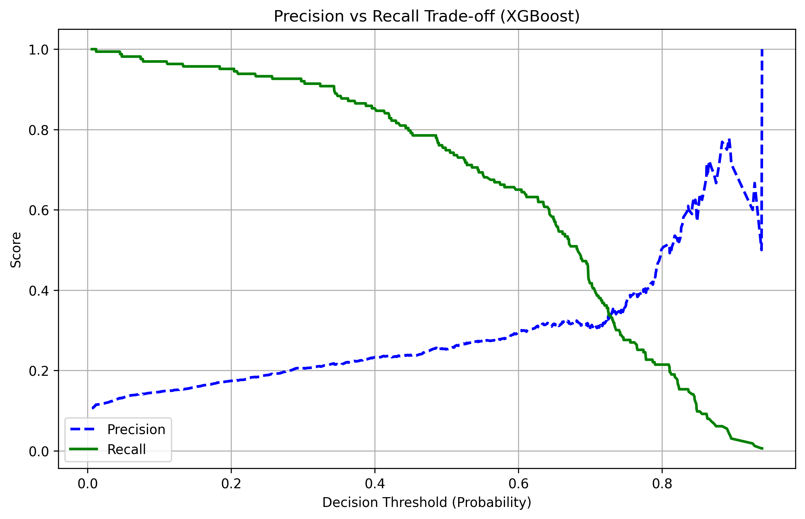
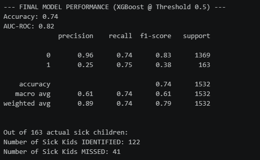
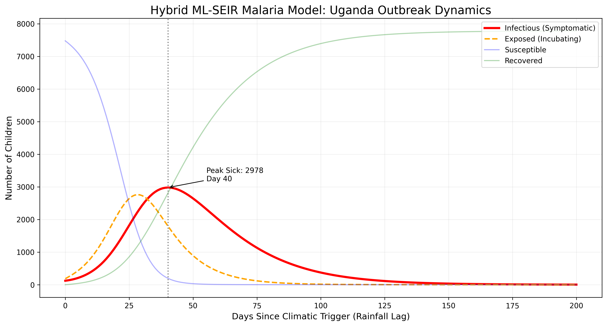
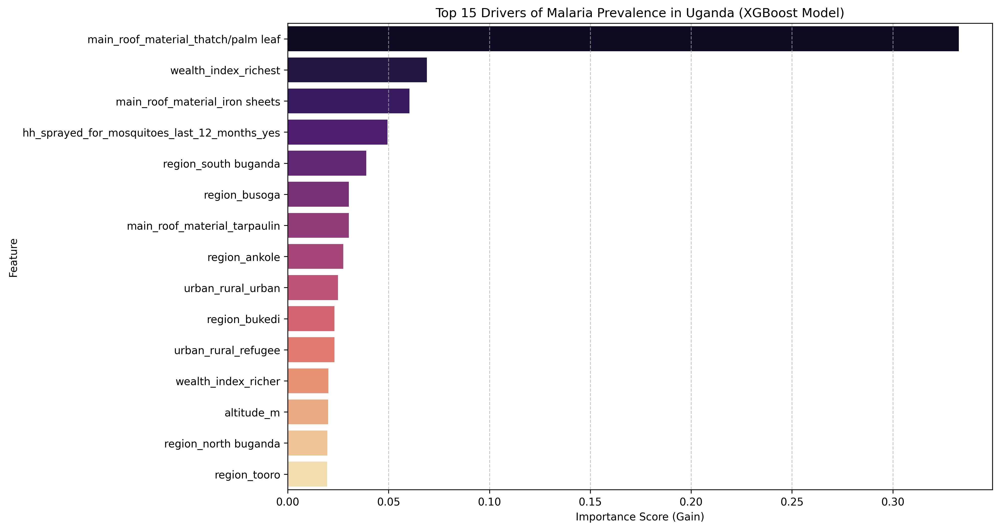
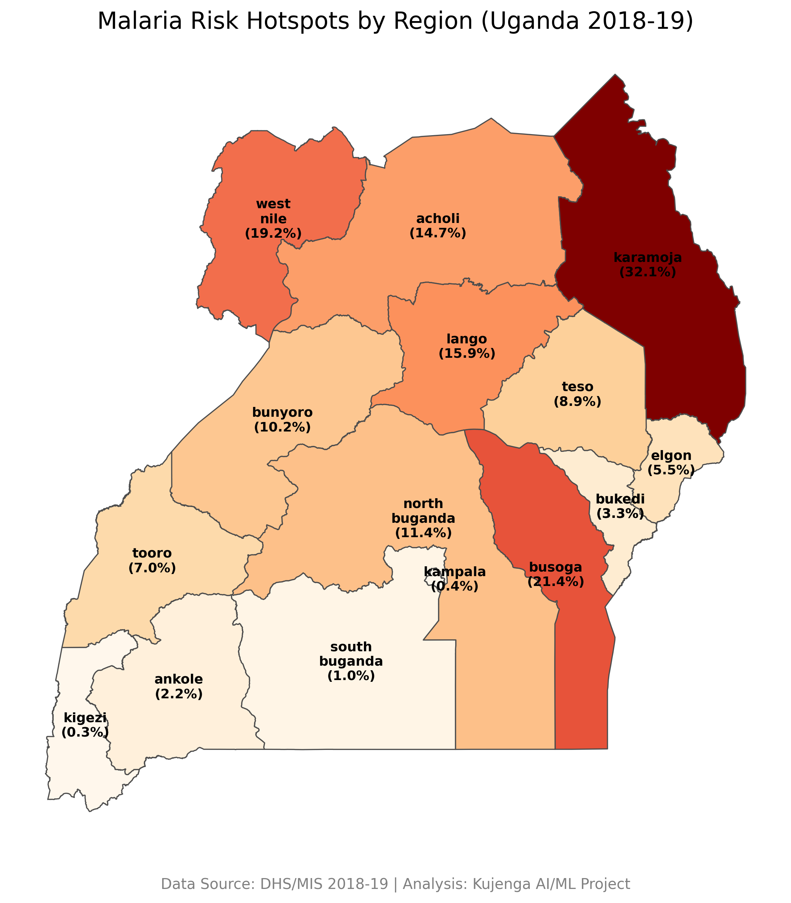

# Predictive Modeling and Spatio-Temporal Simulation of Malaria Outbreaks in Uganda

## Author
**Name:** Ekiru Ernest Ochepa  
**Program:** Kujenga AI/ML Course

---

## Objective

### **Overall Objective**
This research develops a predictive machine learning model to identify malaria risk factors and forecast malaria outbreaks across Uganda.

The project integrates multiple data sources including demographic surveys, household characteristics, geographic information, and satellite-derived environmental variables to build a comprehensive spatio-temporal analysis of malaria transmission patterns.

### **Specific Objective**
1. Develop a predictive machine learning model to identify malaria risk factors
2. Forecast malaria outbreaks across Uganda
3. Build a comprehensive spatio-temporal analysis of malaria transmission patterns

---

# Results

---

## **Model Development and Performance**

Two models were evaluated that is, Random Forest and XGBoost to determine the most effective approach for identifying positive malaria cases. While both models were tested, XGBoost demonstrated superior potential for clinical application due to its high sensitivity

***Baseline Performance (Positive Class: those with Malaria)***
- Random Forest: Recall 0.52 / Precision 0.30
- XGBoost: Recall 0.93 / Precision 0.19

### **The Precision-Recall Trade-off**
In malaria screening, the cost of a False Negative (missing an infected patient) is significantly higher than a False Positive (unnecessary follow-up testing). However, a precision of 0.19 is too low for efficient resource allocation.

The goal here is to identify the "Sweet Spot" using the Precision-Recall Curve. The aim is to find an Optimal Threshold that maintains high diagnostic coverage while reducing "noise."
- ***Target Metric:*** Maintain Recall at approximately 0.75 or above while optimizing Precision to approximately 0.25 and above.

### **Finding the "Elbow"**
By plotting Precision against Recall, we can visually identify the "Elbow", the point of diminishing returns. This is the specific threshold where we maximize the identification of malaria cases before the model's precision drops sharply.

Adjusting the classification threshold allows us to move along this curve to reach our desired performance balance, ensuring the model is both safe for patients and practical for healthcare providers.

**Precision (blue, dashed):** Of all predicted positives, how many are truly positive
- Higher precision score ==> fewer false positives

**Recall (green, solid):** Of all actual positives, how many you correctly identified
- Higher recall score ==> fewer false negatives

**Decision Threshold (Probability):** This is the probability cutoff to classify a case as positive malaria case

#### **Interpreting the graph**

***The Intersection (The Balanced Spot):*** The lines cross at a threshold of approximately 0.72. At this point, both Precision and Recall are roughly 35%. This is fair, but a 35% recall means we are still missing 65% of sick children. Not ideal for an outbreak.

#### **The "Outbreak Prediction" Zone (Threshold 0.30 - 0.55):**
If the threshold is set at 0.50:
- Recall is ~78% (You catch nearly 8 out of 10 cases).
- Precision is ~25% (1 in 4 alerts is a true malaria case).

### **Model Performance Metrics:**

We established the baseline performance of our XGBoost model using a 0.50 decision threshold, which provided the foundation for our subsequent tuning of the Precision-Recall balance.

***Sensitivity (Recall):*** 75% - The model identifies approximately 3 out of 4 malaria-positive individuals

***Specificity:*** 74% - The model correctly identifies 74 out of 100 malaria-negative individuals

***Overall Accuracy:*** 74% - Balanced performance across both positive and negative cases

***Precision:*** 25% - When the model predicts a positive case, it is correct 25% of the time (conservative threshold of 0.50 for public health action)

***AUC-ROC:*** 0.82 - Strong discrimination capability between positive and negative malaria cases

***The confusion matrix revealed:***

- True Negatives: 1,310 (correctly identified negative cases)
- False Positives: 59
- False Negatives: 41 (improved from 126 in initial model)
- True Positives: 122 (improved from 37 in initial model)

***Data Quality:*** Analysis was conducted on 7,787 individual children across Uganda with complete malaria RDT (Rapid Diagnostic Test) results and comprehensive socioeconomic, environmental, and geographic data.

---

## **Outbreak Peak Timing:**

### ***SEIR (Susceptible-Exposed-Infectious-Recovered) Model Dynamics***

## **S** -- β --> **E** --- α ---> **I** --- γ ---> **R**

- β --> Transmission rate
- α --> Incubation rate
- γ --> Recovery rate

- **Peak sick children (unmitigated):** 2,978 children on day 40 post-outbreak initiation
- **Outbreak duration:** Approaximately 200 days (6-7 months) from initial cases to disease fadeout
- **R₀ (basic reproduction number) ≈ 10.09, indicating very high transmission potential**

After heavy rains, mosquito populations increase, creating favorable conditions for malaria transmission within a community of children. At the beginning, most children are healthy, but a small number become infected without showing symptoms. These individuals, represented as the “exposed,” quietly contribute to the spread of the disease. As time progresses, more children transition into the infectious stage, and the number of visibly sick individuals begins to rise steadily.

Using a threshold of 0.50, which is fair, however, it does not raise an alarm at the earliest signs of infection, but instead waits until there is clearer evidence of disease spread. In the early phase of the outbreak (around days 0–25), infections are increasing, but many cases are not yet detected by the system. This means that while transmission is underway, the response may not be immediately triggered.

By around day 40, the outbreak reaches its peak, with approximately 2,978 children actively sick. At this stage, the model is effectively identifying a substantial proportion of cases, about 78%, indicating that the alarm is now clearly active. At this point, the Ministry (or responsible department) can confidently recognize that an outbreak is occurring and mobilize interventions such as increased testing, treatment, and vector control measures. However, because the threshold is not very low, some cases are still missed, allowing a degree of continued transmission.

Following the peak, the number of infectious individuals begins to decline as more children recover, and the outbreak gradually comes under control. The number of susceptible individuals reduces significantly, while the recovered population increases, reflecting successful response efforts and natural disease progression.

Overall, setting the threshold at 0.50 reflects a balanced approach: the system avoids excessive false alarms but does not detect the outbreak at its earliest stage. This makes it suitable for structured public health responses such as mass screening, though it may not be optimal for early outbreak detection where capturing nearly all cases as soon as possible is critical.

---

## **Top 4 Malaria Risk Drivers (Feature Importance)**

The XGBoost model identified the following top factors influencing malaria risk in Uganda:

***Housing Construction - Thatch/Palm Leaf Roofs (0.31 importance)*** - The most dominant risk factor; homes with traditional thatch roofing showed dramatically elevated malaria risk

***Wealth Index - Richest Households (-0.07 importance)*** - Protective factor; wealthier households demonstrated significantly lower infection rates

***Housing Construction - Iron Sheet Roofs (0.06 importance)*** - Moderate protective effect

***Household Insecticide Spraying (IRS) (0.05 importance)*** - Protective intervention; households sprayed in the last 12 months showed reduced malaria risk

***Key Finding:*** Housing quality (particularly roof material) emerged as the strongest predictor of malaria infection, followed by household wealth and regional geography.

---

## **Forecast Malaria Outbreaks Across Uganda**

***Spatio-Temporal Outbreak Dynamics***

Regional Risk Stratification (by malaria prevalence):

- **Very High Risk (>20%):** Karamoja region (32.1%), Busoga region (21.4%)
- **High Risk (15-20%):** Lango region (15.9%), West Nile region (19.2%)
- **Moderate Risk (10-15%):** Acholi region (14.7%), North Buganda region (11.4%), Bunyoro region (10.2%)
- **Low Risk (<10%):** Teso region (8.9%), Kampala region (0.4%), Ankole region (2.2%), Kikezi region (0.3%), South Buganda region (1.0%)

#### **1. High-Prevalence Hotspots**

The high rates in Karamoja (32.1%), Busoga (21.4%), and West Nile (19.2%) are driven by a combination of climate and infrastructure:

- **Altitudes & Climate:** These regions sit at lower elevations (generally 1,000m – 1,200m) compared to the highlands. This creates a warmer environment where Anopheles mosquitoes and the P. falciparum parasite thrive.
- **Rainfall Dynamics:** While Karamoja is semi-arid, its monomodal rainfall (one long season) followed by heat creates stagnant pools that act as massive breeding grounds. In Busoga and West Nile, heavy rainfall provides perennial breeding sites.
- **The "Thatch" Factor:** These regions have a high density of grass-thatched houses with open eaves. Research in Uganda shows that children in traditional thatched homes have double the malaria incidence of those in modern homes because thatch provides easy entry and resting spots for mosquitoes.

#### **2. The Low-Prevalence Leaders: Natural & Man-made Barriers**

Kigezi (0.3%) and Kampala (0.4%) represent the two different ways malaria is suppressed:

- **Kigezi (The Altitude Barrier):** Kigezi is a high-altitude region (often above 1,800m). The cooler temperatures at these heights significantly slow down the parasite's development inside the mosquito, often making transmission biologically impossible.
- **Kampala (The Urban Shield):** As a highly urbanized center, Kampala has fewer open breeding sites (wetlands are often built over) and a vast majority of modern housing (iron sheets, plastered walls, closed eaves). This "urbanicity" drastically reduces the human-biting rate.

---

### **Bed Net Distribution Intervention Analysis:**

- **Baseline peak cases:** 2,978 children (day 40)
- **With mass LLIN distribution:** 2,490 children (day 50)
- **Net reduction:** 488 fewer cases (16% reduction in peak cases)
- **Timing shift:** Peak occurrence delayed by 10 days, allowing healthcare systems additional preparation time

- **Duration flattened:** Outbreak duration extended slightly, reducing system burden

---

## Key Project Components

### 1. **Data Sources**
- **UDHS Malaria Survey Data (UGPR7IFL.DTA):** Individual-level malaria test results using RDT (Rapid Diagnostic Tests) (link: https://dhsprogram.com/data/available-datasets.cfm)
- **Household Recode Data (UGHR7IFL.DTA):** Household wealth, housing materials, and mosquito control interventions (IRS) (link: https://dhsprogram.com/data/available-datasets.cfm)
- **Geographic Data (UGGE7IFL.shp):** GPS coordinates and altitude of survey clusters (link: https://dhsprogram.com/data/available-datasets.cfm)
- **Environmental Data (Google Earth Engine):** Precipitation and temperature variables (lagged by 2 months) -->This is attached
- **Administrative Boundaries:** Uganda district and regional shapefiles for spatial analysis

### 2. **Data Processing Pipeline**
- **Target Variable:** Malaria RDT test results (positive/negative binary classification)
- **Data Cleaning:** Extracted 7,787 individual records with complete malaria test results from 45,767 total respondents
- **Feature Integration:** Merged individual, household, geographic, and environmental datasets using cluster and household identifiers
- **Variable Transformation:** Converted Century Month Code (CMC) dates to calendar years/months for temporal analysis

### 3. **Predictor Variables**
- **Demographic:** Age, sex, household size
- **Socioeconomic:** Wealth index (5-category scale from poorest to richest)
- **Housing Characteristics:** Floor material, wall material, roof material
- **Behavioral:** Bed net usage (LLIN and any net types), ITN access
- **Environmental:** Rainfall (2-month lag), Temperature (2-month lag), Altitude
- **Interventions:** Household IRS (Indoor Residual Spraying) in last 12 months
- **Geographic:** Region, urban/rural classification, GPS coordinates

### 4. **Data Integration Methodology**
- Linked individual malaria test results to household-level socioeconomic data
- Attached geographic coordinates and altitude to survey clusters
- Extracted Google Earth Engine environmental variables at survey point locations
- Handled missing satellite data through mean imputation for precipitation and temperature

---

## Dataset Summary
- **Total Records:** 7,787 children tested for malaria
- **Geographic Coverage:** All regions and districts of Uganda
- **Temporal Period:** Survey conducted across multiple years with 2-month lagged environmental variables
- **Class Distribution:** Classified individuals as malaria-positive or malaria-negative based on RDT results

---

